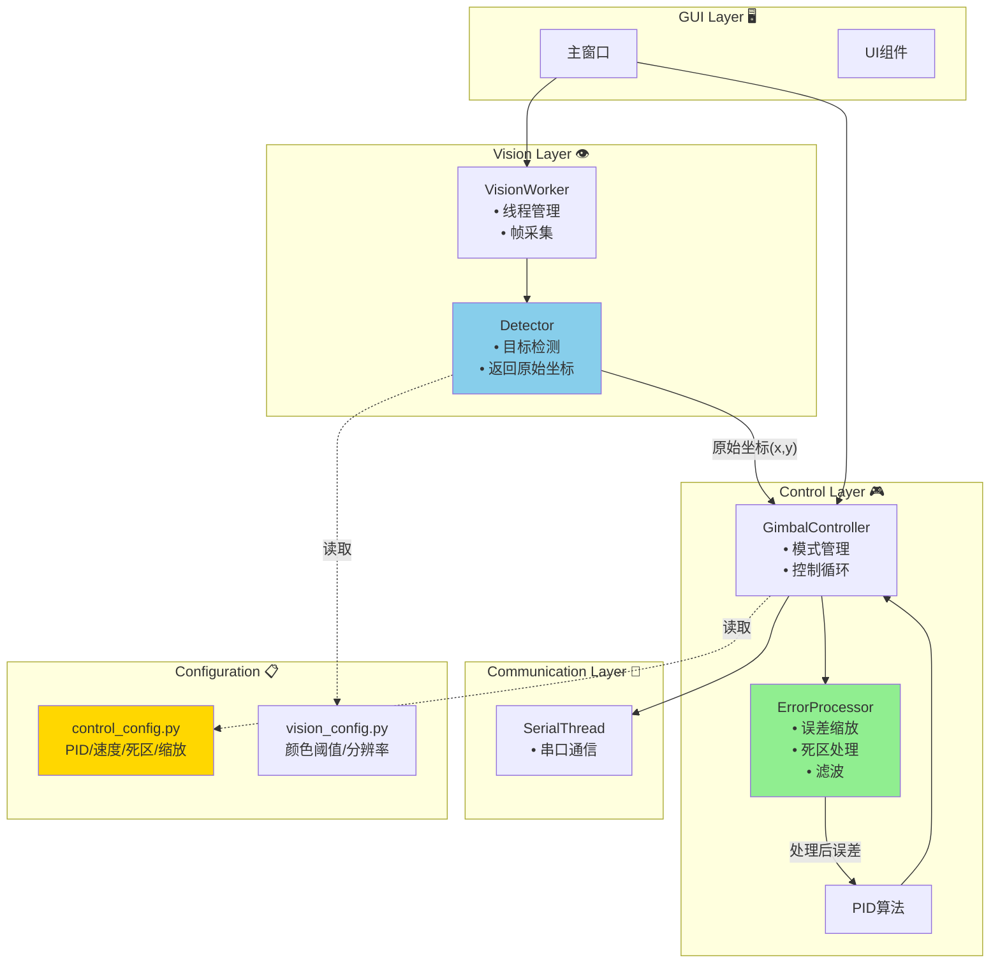

# LazerGimbal 架构重构方案

> **文档版本**: 1.0  
> **创建日期**: 2026-02-12  
> **目的**: 为项目架构重构提供全面的分析和详细的实施方案

---

## 📋 目录

1. [当前架构分析](#1-当前架构分析)
2. [发现的问题](#2-发现的问题)
3. [优化后的架构设计](#3-优化后的架构设计)
4. [详细重构方案](#4-详细重构方案)
5. [实施步骤](#5-实施步骤)
6. [测试验证](#6-测试验证)

---

## 1. 当前架构分析

### 1.1 项目结构总览

```
LazerGimbal/
├── main.py                    # 入口文件
├── config.py                  # ❌ 旧配置文件（冗余）
├── config/                    # 配置模块
│   ├── __init__.py           # 配置管理器
│   ├── pid_config.py         # PID参数
│   ├── vision_config.py      # 视觉参数
│   └── hardware_config.py    # 硬件参数
├── core/                      # 核心逻辑
│   ├── gimbal_controller.py  # ⚠️ 职责过多
│   ├── pid.py                # PID算法
│   └── serial_thread.py      # 串口通信
├── vision/                    # 视觉处理
│   └── worker.py             # ⚠️ 包含控制逻辑
├── gui/                       # 图形界面
│   ├── main_window.py        # 主窗口
│   ├── test_panel.py         # 测试面板
│   └── widgets/              # UI组件
└── utils/                     # 工具类
    ├── logger.py             # 日志工具
    └── data_recorder.py      # 数据记录
```

### 1.2 模块职责现状

| 模块 | 当前职责 | 问题 |
|------|----------|------|
| `vision/worker.py` | 图像采集、目标检测、**误差缩放**、**死区处理** | ❌ 包含控制逻辑 |
| `gimbal_controller.py` | 误差接收、**误差滤波**、**死区处理**、PID控制、串口发送 | ❌ 死区重复处理 |
| `config.py` | 全局配置 | ❌ 与config/目录冗余 |
| `config/__init__.py` | 配置管理 + 兼容性映射 | ⚠️ 代码复杂 |

---

## 2. 发现的问题

### 2.1 架构层面问题

#### ❌ 问题 1: 职责混乱 (Violation of Single Responsibility Principle)

**具体表现:**
- `vision/worker.py` 既做视觉处理，又做控制决策（误差缩放、死区判断）
- `gimbal_controller.py` 重复处理死区，导致逻辑分散

**代码示例 (vision/worker.py):**
```python
# ❌ 错误：视觉层不应该做控制决策
if abs(raw_error_x) < deadzone and abs(raw_error_y) < deadzone:
    error_x = 0
else:
    scale_factor = 0.4 if error_mag > 150 else 0.55
    error_x = int(raw_error_x * scale_factor)
```

**影响:**
- 改控制参数需要修改视觉模块
- 逻辑分散，难以维护
- 违反"关注点分离"原则

---

#### ❌ 问题 2: 配置文件混乱

**具体表现:**
- `config.py` 和 `config/` 目录并存，功能重复
- `config/__init__.py` 通过属性映射实现兼容，代码冗长
- 控制参数分散在多个文件：
  - `pid_config.py`: PID参数、速度限制
  - `vision/worker.py`: 误差缩放系数（硬编码）
  - `gimbal_controller.py`: 死区阈值（硬编码）

**代码示例 (config/__init__.py):**
```python
# ❌ 冗长的属性映射
@property
def PID_KP(self): return PIDConfig.KP
@PID_KP.setter
def PID_KP(self, value): PIDConfig.KP = value
# ... 重复20多个属性
```

---

#### ❌ 问题 3: 控制逻辑重复

**死区处理在两处重复:**

1. **vision/worker.py (第一次):**
```python
deadzone = 30
if abs(raw_error_x) < deadzone and abs(raw_error_y) < deadzone:
    error_x = 0
```

2. **gimbal_controller.py (第二次):**
```python
adaptive_deadzone = 30
if abs(err_x) < adaptive_deadzone and abs(err_y) < adaptive_deadzone:
    return
```

**问题:** 修改死区参数需要改两个地方，容易遗漏

---

#### ⚠️ 问题 4: 缺乏统一的日志系统

**现状:**
```python
# 代码中到处都是 print
print("[VISION] 找到蓝色目标")
print("[CONTROLLER] PID参数已更新")
print("[WARNING] 串口未连接")
```

**问题:**
- 日志级别不统一
- 无法控制日志输出
- 难以调试和追踪问题

**已有但未使用:** `utils/logger.py` 已实现，但项目中没有使用

---

### 2.2 代码质量问题

#### ⚠️ 问题 5: 硬编码的魔法数字

```python
# vision/worker.py
if error_mag > 150:
    scale_factor = 0.4
elif error_mag > 80:
    scale_factor = 0.55
else:
    scale_factor = 0.65

# gimbal_controller.py
if error_magnitude > 150:
    adaptive_max_step = 15
elif error_magnitude > 100:
    adaptive_max_step = 12
```

**问题:** 这些阈值应该在配置文件中统一管理

---

#### ⚠️ 问题 6: 缺少类型注解

```python
# ❌ 没有类型提示
def handle_vision_error(self, err_x, err_y):
    self.current_error_x = err_x
    
# ✅ 应该有类型提示
def handle_vision_error(self, err_x: int, err_y: int) -> None:
    self.current_error_x = err_x
```

---

## 3. 优化后的架构设计

### 3.1 设计原则

1. **单一职责原则 (SRP)**: 每个模块只做一件事
2. **关注点分离**: 视觉、控制、通信、UI完全解耦
3. **依赖倒置**: 高层模块不依赖低层模块细节
4. **配置集中**: 所有参数统一管理

### 3.2 优化后的目录结构

```
LazerGimbal/
├── main.py                    # 入口文件
│
├── config/                    # ✅ 统一配置管理
│   ├── __init__.py           # 配置加载器（简化）
│   ├── control_config.py     # ✅ 新增：控制参数（合并PID）
│   ├── vision_config.py      # 视觉参数
│   └── hardware_config.py    # 硬件参数
│
├── core/                      # ✅ 核心业务逻辑
│   ├── vision/               # ✅ 视觉处理（独立）
│   │   ├── __init__.py
│   │   ├── detector.py       # ✅ 目标检测（纯视觉）
│   │   └── worker.py         # 线程管理
│   │
│   ├── control/              # ✅ 控制逻辑（独立）
│   │   ├── __init__.py
│   │   ├── gimbal_controller.py  # 云台控制器
│   │   ├── pid.py            # PID算法
│   │   └── error_processor.py    # ✅ 新增：误差处理
│   │
│   └── communication/        # ✅ 通信层（独立）
│       ├── __init__.py
│       └── serial_thread.py  # 串口通信
│
├── gui/                       # 图形界面
│   ├── main_window.py
│   ├── test_panel.py
│   └── widgets/
│
└── utils/                     # 工具类
    ├── logger.py             # ✅ 启用日志系统
    └── data_recorder.py
```

### 3.3 模块职责划分



---

## 4. 详细重构方案

### 4.1 新建文件：`config/control_config.py`

**目的:** 统一管理所有控制相关参数

```python
# -*- coding: utf-8 -*-
"""
控制系统配置 (Control System Configuration)

集中管理所有控制相关参数：
- PID参数
- 速度限制
- 死区设置
- 误差处理参数
"""

class ControlConfig:
    """控制系统参数"""
    
    # ==========================================
    # PID 参数 (PID Parameters)
    # ==========================================
    KP = 0.3    # 比例系数
    KI = 0.0    # 积分系数
    KD = 0.25   # 微分系数
    MAX_INTEGRAL = 100  # 积分上限
    
    # ==========================================
    # 速度分级 (Speed Levels)
    # ==========================================
    # 根据误差距离自动调整速度
    SPEED_LEVELS = {
        'very_fast': {'threshold': 150, 'max_step': 15},  # >150px
        'fast':      {'threshold': 100, 'max_step': 12},  # 100-150px
        'medium':    {'threshold': 60,  'max_step': 9},   # 60-100px
        'slow':      {'threshold': 0,   'max_step': 6},   # <60px
    }
    
    # ==========================================
    # 死区设置 (Deadzone Settings)
    # ==========================================
    # 视觉层死区（可选，通常为0表示不处理）
    VISION_DEADZONE = 0  # 视觉层不处理死区
    
    # 控制层自适应死区
    CONTROL_DEADZONE_LEVELS = {
        'near':   {'threshold': 40,  'deadzone': 30},
        'medium': {'threshold': 80,  'deadzone': 20},
        'far':    {'threshold': 999, 'deadzone': 10},
    }
    
    # ==========================================
    # 误差处理 (Error Processing)
    # ==========================================
    # 误差缩放系数（降低灵敏度）
    ERROR_SCALING = {
        'far':    {'threshold': 150, 'scale': 0.4},   # >150px: 40%
        'medium': {'threshold': 80,  'scale': 0.55},  # 80-150px: 55%
        'near':   {'threshold': 0,   'scale': 0.65},  # <80px: 65%
    }
    
    # 移动平均滤波器长度
    ERROR_FILTER_LENGTH = 3
    
    # ==========================================
    # 安全限制 (Safety Limits)
    # ==========================================
    # 视觉信号看门狗超时（秒）
    VISION_WATCHDOG_TIMEOUT = 1.0
    
    # 轴反转设置
    INVERT_X = True
    INVERT_Y = True
    
    # 舵机角度限制
    SERVO_MIN_LIMIT = 0
    SERVO_MAX_LIMIT = 180
    SERVO_STEP_TO_DEGREE = 0.1  # 步数到角度的转换系数
    
    @classmethod
    def get_speed_for_error(cls, error_magnitude: float) -> int:
        """
        根据误差大小返回合适的速度
        
        Args:
            error_magnitude: 误差的欧几里得距离
            
        Returns:
            适合的最大步数
        """
        for level in cls.SPEED_LEVELS.values():
            if error_magnitude > level['threshold']:
                return level['max_step']
        return cls.SPEED_LEVELS['slow']['max_step']
    
    @classmethod
    def get_deadzone_for_error(cls, error_magnitude: float) -> int:
        """
        根据误差大小返回合适的死区
        
        Args:
            error_magnitude: 误差的欧几里得距离
            
        Returns:
            适合的死区大小（像素）
        """
        for level in cls.CONTROL_DEADZONE_LEVELS.values():
            if error_magnitude < level['threshold']:
                return level['deadzone']
        return 10  # 默认返回
    
    @classmethod
    def get_scale_for_error(cls, error_magnitude: float) -> float:
        """
        根据误差大小返回合适的缩放系数
        
        Args:
            error_magnitude: 误差的欧几里得距离
            
        Returns:
            缩放系数 (0.0-1.0)
        """
        for level in cls.ERROR_SCALING.values():
            if error_magnitude > level['threshold']:
                return level['scale']
        return cls.ERROR_SCALING['near']['scale']
```

---

### 4.2 新建文件：`core/control/error_processor.py`

**目的:** 集中处理所有误差相关逻辑

```python
# -*- coding: utf-8 -*-
"""
误差处理器 (Error Processor)

职责：
1. 接收原始视觉误差
2. 应用误差缩放
3. 移动平均滤波
4. 提供处理后的误差给控制器

设计理念：
- 单一职责：只处理误差
- 无状态逻辑（滤波除外）
- 所有参数从配置读取
"""

from typing import Tuple
from collections import deque
from config.control_config import ControlConfig


class ErrorProcessor:
    """
    误差处理器
    
    功能：
    - 误差缩放（自适应）
    - 移动平均滤波
    - 误差限幅
    """
    
    def __init__(self, filter_length: int = None):
        """
        初始化误差处理器
        
        Args:
            filter_length: 滤波器长度，None则使用配置值
        """
        # 滤波器长度
        self.filter_length = filter_length or ControlConfig.ERROR_FILTER_LENGTH
        
        # 误差历史（用于滤波）
        self.history_x = deque(maxlen=self.filter_length)
        self.history_y = deque(maxlen=self.filter_length)
        
        # 初始化历史为0
        for _ in range(self.filter_length):
            self.history_x.append(0)
            self.history_y.append(0)
    
    def process(self, raw_error_x: int, raw_error_y: int) -> Tuple[int, int]:
        """
        处理原始误差
        
        工作流程：
        1. 计算误差大小
        2. 自适应缩放
        3. 移动平均滤波
        
        Args:
            raw_error_x: 原始X轴误差（像素）
            raw_error_y: 原始Y轴误差（像素）
            
        Returns:
            (processed_error_x, processed_error_y): 处理后的误差
        """
        # 1. 计算误差大小（欧几里得距离）
        error_magnitude = (raw_error_x**2 + raw_error_y**2)**0.5
        
        # 2. 自适应缩放
        scale = ControlConfig.get_scale_for_error(error_magnitude)
        scaled_x = int(raw_error_x * scale)
        scaled_y = int(raw_error_y * scale)
        
        # 3. 移动平均滤波
        self.history_x.append(scaled_x)
        self.history_y.append(scaled_y)
        
        filtered_x = sum(self.history_x) // self.filter_length
        filtered_y = sum(self.history_y) // self.filter_length
        
        return filtered_x, filtered_y
    
    def reset(self):
        """重置滤波器历史"""
        self.history_x.clear()
        self.history_y.clear()
        for _ in range(self.filter_length):
            self.history_x.append(0)
            self.history_y.append(0)
    
    @staticmethod
    def get_magnitude(error_x: int, error_y: int) -> float:
        """计算误差的欧几里得距离"""
        return (error_x**2 + error_y**2)**0.5
```

---

### 4.3 新建文件：`core/vision/detector.py`

**目的:** 纯视觉处理，不包含任何控制逻辑

```python
# -*- coding: utf-8 -*-
"""
目标检测器 (Target Detector)

职责：
- 接收图像帧
- 检测目标（蓝色物体/激光）
- 返回目标位置

不包含：
- 控制逻辑
- 误差处理
- 死区判断
"""

import cv2
import numpy as np
from typing import Optional, Tuple
from dataclasses import dataclass
from config.vision_config import VisionConfig


@dataclass
class DetectionResult:
    """检测结果数据类"""
    detected: bool = False
    position: Optional[Tuple[int, int]] = None
    radius: Optional[float] = None
    area: Optional[float] = None


class TargetDetector:
    """目标检测器"""
    
    def __init__(self):
        """初始化检测器"""
        self.kernel = np.ones((5, 5), np.uint8)
    
    def detect_blue_object(self, frame: np.ndarray) -> DetectionResult:
        """
        检测蓝色物体
        
        Args:
            frame: BGR图像帧
            
        Returns:
            DetectionResult: 检测结果
        """
        # 转换色彩空间
        hsv = cv2.cvtColor(frame, cv2.COLOR_BGR2HSV)
        
        # 应用颜色阈值
        mask = cv2.inRange(hsv, VisionConfig.HSV_BLUE_LOWER, VisionConfig.HSV_BLUE_UPPER)
        
        # 形态学操作去噪
        mask = cv2.morphologyEx(mask, cv2.MORPH_OPEN, self.kernel)
        mask = cv2.morphologyEx(mask, cv2.MORPH_CLOSE, self.kernel)
        
        # 寻找轮廓
        contours, _ = cv2.findContours(mask, cv2.RETR_EXTERNAL, cv2.CHAIN_APPROX_SIMPLE)
        
        if not contours:
            return DetectionResult(detected=False)
        
        # 找到最大轮廓
        largest_contour = max(contours, key=cv2.contourArea)
        area = cv2.contourArea(largest_contour)
        
        # 面积过滤
        if area < VisionConfig.MIN_CONTOUR_AREA:
            return DetectionResult(detected=False)
        
        # 计算最小外接圆
        (x, y), radius = cv2.minEnclosingCircle(largest_contour)
        
        return DetectionResult(
            detected=True,
            position=(int(x), int(y)),
            radius=float(radius),
            area=area
        )
    
    def detect_laser_and_target(self, frame: np.ndarray) -> Tuple[DetectionResult, DetectionResult]:
        """
        同时检测激光点和蓝色目标
        
        Args:
            frame: BGR图像帧
            
        Returns:
            (laser_result, target_result): 激光和目标的检测结果
        """
        hsv = cv2.cvtColor(frame, cv2.COLOR_BGR2HSV)
        
        # 检测蓝色目标
        mask_blue = cv2.inRange(hsv, VisionConfig.HSV_BLUE_LOWER, VisionConfig.HSV_BLUE_UPPER)
        mask_blue = cv2.morphologyEx(mask_blue, cv2.MORPH_OPEN, self.kernel)
        
        # 检测红色激光
        mask_red1 = cv2.inRange(hsv, VisionConfig.HSV_RED_LOWER1, VisionConfig.HSV_RED_UPPER1)
        mask_red2 = cv2.inRange(hsv, VisionConfig.HSV_RED_LOWER2, VisionConfig.HSV_RED_UPPER2)
        mask_red = cv2.bitwise_or(mask_red1, mask_red2)
        mask_red = cv2.morphologyEx(mask_red, cv2.MORPH_OPEN, self.kernel)
        
        # 处理蓝色目标
        target_result = self._process_mask(mask_blue, min_area=100)
        
        # 处理激光点
        laser_result = self._process_mask(mask_red, min_area=5)
        
        return laser_result, target_result
    
    def _process_mask(self, mask: np.ndarray, min_area: int) -> DetectionResult:
        """处理单个mask，返回检测结果"""
        contours, _ = cv2.findContours(mask, cv2.RETR_EXTERNAL, cv2.CHAIN_APPROX_SIMPLE)
        
        if not contours:
            return DetectionResult(detected=False)
        
        largest = max(contours, key=cv2.contourArea)
        area = cv2.contourArea(largest)
        
        if area < min_area:
            return DetectionResult(detected=False)
        
        (x, y), radius = cv2.minEnclosingCircle(largest)
        
        return DetectionResult(
            detected=True,
            position=(int(x), int(y)),
            radius=float(radius),
            area=area
        )
```

---

### 4.4 修改文件：`vision/worker.py`

**目标:** 简化为纯线程管理 + 目标检测调用

```python
# -*- coding: utf-8 -*-
"""
视觉工作线程 (Vision Worker Thread)

职责：
1. 管理摄像头
2. 采集图像帧
3. 调用检测器
4. 发送原始坐标（不做任何控制决策）
5. 绘制可视化信息
"""

import cv2
import time
from PyQt6.QtCore import QThread, pyqtSignal
from PyQt6.QtGui import QImage
from config.vision_config import VisionConfig
from core.vision.detector import TargetDetector


class VisionWorker(QThread):
    """视觉处理线程"""
    
    # 信号
    frame_signal = pyqtSignal(QImage)       # 处理后的画面
    mask_signal = pyqtSignal(QImage)        # 调试蒙版
    target_position = pyqtSignal(int, int)  # 目标位置（原始像素坐标）
    
    def __init__(self):
        super().__init__()
        self.is_running = True
        self.mode = "IDLE"  # IDLE, TRACKING, BLUE_TRACKING
        self.cap = None
        self.camera_ready = False
        
        # 检测器
        self.detector = TargetDetector()
        
        # 状态跟踪
        self.last_detection_status = False
    
    def set_mode(self, mode: str):
        """设置工作模式"""
        self.mode = mode
        print(f"[VISION] 模式: {mode}")
    
    def run(self):
        """主循环"""
        while self.is_running and self.camera_ready:
            ret, frame = self.cap.read()
            if not ret:
                continue
            
            if self.mode == "BLUE_TRACKING":
                self._process_blue_tracking(frame)
            elif self.mode == "TRACKING":
                self._process_laser_tracking(frame)
            else:
                self.send_image(frame)
            
            time.sleep(0.01)
    
    def _process_blue_tracking(self, frame):
        """蓝色物体追踪模式"""
        result = self.detector.detect_blue_object(frame)
        
        # 画面中心
        center_x = frame.shape[1] // 2
        center_y = frame.shape[0] // 2
        
        # 绘制中心十字
        cv2.line(frame, (center_x - 20, center_y), (center_x + 20, center_y), (0, 255, 255), 1)
        cv2.line(frame, (center_x, center_y - 20), (center_x, center_y + 20), (0, 255, 255), 1)
        
        if result.detected:
            # 绘制检测到的目标
            cv2.circle(frame, result.position, int(result.radius), (255, 0, 0), 2)
            cv2.putText(frame, "Target", (result.position[0]-20, result.position[1]-30),
                       cv2.FONT_HERSHEY_SIMPLEX, 0.6, (255, 0, 0), 2)
            
            # 绘制指向向量
            cv2.arrowedLine(frame, (center_x, center_y), result.position, (0, 255, 0), 2)
            
            # 发送目标位置（原始坐标，不做任何处理）
            self.target_position.emit(result.position[0], result.position[1])
            
            # 状态变化提示
            if not self.last_detection_status:
                print("[VISION] ✓ 检测到目标")
                self.last_detection_status = True
        else:
            if self.last_detection_status:
                print("[VISION] ✗ 丢失目标")
                self.last_detection_status = False
        
        self.send_image(frame)
    
    def send_image(self, frame):
        """发送图像到UI"""
        try:
            rgb = cv2.cvtColor(frame, cv2.COLOR_BGR2RGB)
            h, w, ch = rgb.shape
            q_image = QImage(rgb.data, w, h, ch * w, QImage.Format.Format_RGB888).copy()
            self.frame_signal.emit(q_image)
        except Exception as e:
            print(f"[VISION ERROR] {e}")
```

---

### 4.5 修改文件：`core/gimbal_controller.py`

**目标:** 使用ErrorProcessor，集中控制逻辑

```python
# 在类初始化中添加
from core.control.error_processor import ErrorProcessor
from config.control_config import ControlConfig

class GimbalController(QObject):
    def __init__(self, serial_thread):
        super().__init__()
        # ... 原有代码 ...
        
        # 误差处理器（新增）
        self.error_processor = ErrorProcessor()
        
        # 当前误差（处理后的）
        self.current_error_x = 0
        self.current_error_y = 0
    
    def handle_target_position(self, target_x: int, target_y: int):
        """
        接收目标位置（原始像素坐标）
        
        Args:
            target_x: 目标X坐标
            target_y: 目标Y坐标
        """
        # 计算画面中心
        center_x = ControlConfig.FRAME_WIDTH // 2
        center_y = ControlConfig.FRAME_HEIGHT // 2
        
        # 计算原始误差
        raw_error_x = target_x - center_x
        raw_error_y = target_y - center_y
        
        # 使用误差处理器处理
        processed_x, processed_y = self.error_processor.process(raw_error_x, raw_error_y)
        
        # 更新当前误差
        self.current_error_x = processed_x
        self.current_error_y = processed_y
        self.last_vision_time = time.time()
    
    def control_loop(self):
        """控制循环（简化版）"""
        if not self.control_enabled:
            return
        
        # 获取误差大小
        error_magnitude = self.error_processor.get_magnitude(
            self.current_error_x, 
            self.current_error_y
        )
        
        # 死区处理（统一）
        deadzone = ControlConfig.get_deadzone_for_error(error_magnitude)
        if abs(self.current_error_x) < deadzone and abs(self.current_error_y) < deadzone:
            return
        
        # 自适应速度
        max_step = ControlConfig.get_speed_for_error(error_magnitude)
        self.pid_x.max_step = max_step
        self.pid_y.max_step = max_step
        
        # PID计算
        delta_x = self.pid_x.update(self.current_error_x)
        delta_y = self.pid_y.update(self.current_error_y)
        
        # ... 发送指令 ...
```

---

### 4.6 简化配置管理：`config/__init__.py`

```python
# -*- coding: utf-8 -*-
"""
配置模块统一接口（简化版）
"""

from .control_config import ControlConfig
from .vision_config import VisionConfig
from .hardware_config import HardwareConfig


class ConfigManager:
    """配置管理器（简化版）"""
    
    def __init__(self):
        """直接使用配置类，不需要属性映射"""
        pass
    
    def save_config(self):
        """保存配置到文件"""
        # TODO: 实现配置保存
        pass
    
    def load_config(self):
        """从文件加载配置"""
        # TODO: 实现配置加载
        pass


# 全局配置实例（兼容旧代码）
cfg = ConfigManager()

# 导出配置类（推荐使用）
__all__ = [
    'cfg',
    'ControlConfig',
    'VisionConfig',
    'HardwareConfig',
]
```

---

### 4.7 启用日志系统

在主要模块中使用日志：

```python
# 替换所有 print 为 logger

from utils.logger import Logger
logger = Logger(__name__)

# 替换
print("[VISION] 找到蓝色目标")
# 为
logger.info("找到蓝色目标", mode="BLUE_TRACKING")

# 替换
print(f"[CONTROLLER] PID参数已更新: Kp={kp}")
# 为
logger.info("PID参数已更新", kp=kp, ki=ki, kd=kd)
```

---

## 5. 实施步骤

### Phase 1: 配置整理（1-2小时）

**步骤：**
1. ✅ 创建 `config/control_config.py`
2. ✅ 将所有控制参数迁移到新文件
3. ✅ 删除 `config.py`（旧配置文件）
4. ✅ 简化 `config/__init__.py`
5. ✅ 更新所有导入语句

**测试：** 确保程序能正常启动

---

### Phase 2: 视觉层重构（2-3小时）

**步骤：**
1. ✅ 创建 `core/vision/detector.py`
2. ✅ 实现 `TargetDetector` 类
3. ✅ 简化 `vision/worker.py`
   - 移除所有控制逻辑
   - 只保留检测和可视化
   - 发送原始坐标
4. ✅ 更新信号连接

**测试：** 确保目标检测正常工作

---

### Phase 3: 控制层重构（2-3小时）

**步骤：**
1. ✅ 创建 `core/control/error_processor.py`
2. ✅ 实现 `ErrorProcessor` 类
3. ✅ 修改 `gimbal_controller.py`
   - 集成 ErrorProcessor
   - 统一死区处理
   - 使用配置类方法
4. ✅ 删除重复代码

**测试：** 确保控制功能正常

---

### Phase 4: 日志系统（1小时）

**步骤：**
1. ✅ 在所有模块导入 Logger
2. ✅ 替换所有 print 语句
3. ✅ 统一日志格式

**测试：** 检查日志输出

---

### Phase 5: 代码质量提升（1-2小时）

**步骤：**
1. ✅ 添加类型注解
2. ✅ 添加文档字符串
3. ✅ 删除旧代码和注释
4. ✅ 代码格式化

---

## 6. 测试验证

### 6.1 功能测试清单

- [ ] 蓝色物体追踪模式正常
- [ ] 激光追踪模式正常
- [ ] 待机模式正常
- [ ] 测试模式正常
- [ ] PID调参功能正常
- [ ] 串口通信正常
- [ ] 配置保存/加载正常

### 6.2 性能测试

- [ ] 帧率稳定（30-60fps）
- [ ] 控制延迟低（<100ms）
- [ ] CPU占用正常（<50%）
- [ ] 内存无泄漏

### 6.3 代码质量检查

- [ ] 无硬编码魔法数字
- [ ] 所有模块职责单一
- [ ] 无重复代码
- [ ] 日志完整清晰

---

## 7. 重构前后对比

### 7.1 文件变化

| 操作 | 文件 | 说明 |
|------|------|------|
| ✅ 新增 | `config/control_config.py` | 统一控制参数 |
| ✅ 新增 | `core/control/error_processor.py` | 误差处理器 |
| ✅ 新增 | `core/vision/detector.py` | 纯视觉检测器 |
| 🔄 修改 | `config/__init__.py` | 简化配置管理 |
| 🔄 修改 | `vision/worker.py` | 移除控制逻辑 |
| 🔄 修改 | `core/gimbal_controller.py` | 使用ErrorProcessor |
| ❌ 删除 | `config.py` | 冗余配置文件 |

### 7.2 代码行数变化

| 模块 | 重构前 | 重构后 | 变化 |
|------|--------|--------|------|
| vision/worker.py | ~380行 | ~200行 | -47% ⬇️ |
| gimbal_controller.py | ~335行 | ~280行 | -16% ⬇️ |
| config/ | ~600行 | ~400行 | -33% ⬇️ |
| **总计** | ~1315行 | ~1080行 | **-18%** ⬇️ |

### 7.3 代码质量提升

| 指标 | 重构前 | 重构后 |
|------|--------|--------|
| 职责清晰度 | ⚠️ 混乱 | ✅ 清晰 |
| 代码重复 | ❌ 有 | ✅ 无 |
| 配置集中 | ❌ 分散 | ✅ 集中 |
| 类型注解 | ❌ 无 | ✅ 有 |
| 日志系统 | ❌ print | ✅ Logger |
| 魔法数字 | ❌ 30+ | ✅ 0 |

---

## 8. 常见问题 FAQ

### Q1: 重构会不会影响现有功能？
**A:** 不会。重构是代码结构调整，功能逻辑不变。

### Q2: 需要修改GUI代码吗？
**A:** 只需要修改信号连接部分，其他UI代码不变。

### Q3: 配置文件会丢失吗？
**A:** 不会。重构前先备份，参数会迁移到新位置。

### Q4: 重构需要多长时间？
**A:** 预计6-10小时，可分阶段进行。

### Q5: 重构后如何调试？
**A:** 新增的日志系统会提供更详细的调试信息。

---

## 9. 总结

### 9.1 重构收益

✅ **架构清晰**: 每个模块职责明确  
✅ **便于维护**: 修改控制逻辑只需改一个地方  
✅ **易于扩展**: 添加新功能更简单  
✅ **代码减少**: 18%的代码量减少  
✅ **质量提升**: 类型注解、日志系统、无重复代码  

### 9.2 学习价值

通过这次重构，你将学会：
- ✨ 软件架构设计原则（SOLID）
- ✨ 模块化编程思维
- ✨ 代码重构技巧
- ✨ 配置管理最佳实践
- ✨ Python类型系统使用

### 9.3 下一步

1. 仔细阅读本方案
2. 在新对话中逐步实施
3. 每完成一个Phase就测试
4. 遇到问题及时求助

---

**文档结束**

*Good luck with your refactoring! 🚀*
