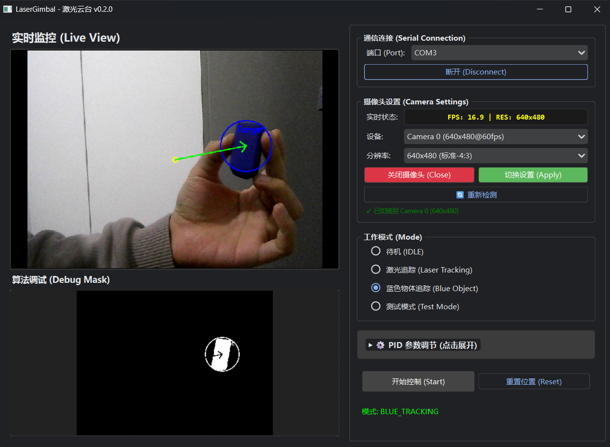

# Laser Gimbal Pro

A 2-axis laser gimbal tracking system using OpenCV and STM32.

## Overview
This project implements a computer vision-based tracking system that controls a 2-axis servo gimbal to follow a target (Red Laser or Blue Object). It uses a PID controller for smooth movement and includes a manual test mode for calibration.

## Demo Videos
- [V0.1.0 Laser Tracking Demo](https://www.youtube.com/shorts/czz0KMfvBXw) - Real-time laser tracking demonstration
- [V0.1.5 Laser Tracking Demo](https://www.youtube.com/watch?v=KGi6N0OxIrQ) - Real-time laser tracking demonstration PID test
- [V0.1.6 Manual Test Mode](https://www.youtube.com/shorts/dynt_BvkDTA) - Manual control and calibration


## System Images

<div align="center">
  
  <p><i>Complete Laser Gimbal System</i></p>
  
  
  <p><i>Pan-Tilt Servo Mechanism</i></p>
  
  
  <p><i>Control Interface - Tracking Mode & Manual Test Panel</i></p>
</div>

## Features
- **Visual Tracking**: Real-time tracking of Red (Laser) or Blue objects using HSV color space.
- **PID Control**: Custom PID algorithm (`core/pid.py`) for smooth and accurate servo positioning.
- **Manual Test Mode**: Keyboard and UI controls to manually move the gimbal for testing and calibration.
- **Safety Mechanisms**:
  - Software Limits (0-180 degrees)
  - Vision Signal Watchdog (Stops if target lost > 1s)
  - Movement Deadzone (Prevents jitter)
- **Architecture**: Multi-threaded design separating Vision (OpenCV), GUI (PyQt6), and Serial Communication.

## Hardware Requirements

### Electronics
- **Microcontroller**: STM32F401CCU6
- **Servos**: 2x MG996R High-Torque Servos (Pan/Tilt)
- **Bluetooth Module**: HC-05 (Serial Communication)
- **Camera**: Laptop built-in webcam (*Temporary solution - dedicated vision module to be added*)
- **Laser**: Red laser pointer (optional, for tracking demonstration)

### Power Supply
- **Current**: 4x 1.5V Duracell AA Batteries (6V output)
- **Planned Upgrade**: 12V DC Adapter + XL4016 Buck Converter (for stable voltage and current)

### Mechanical Structure
- **3D Printed Pan-Tilt Mechanism**: [MakerWorld - Pan Tilt Servo Antenna Tracker MG996R](https://makerworld.com/en/models/973248-pan-tilt-servo-antenna-tracker-mg996r#profileId-945437)
- Designed for MG996R servos with robust mounting

> **Note**: The system currently uses a laptop camera for vision processing. A dedicated vision module (e.g., OpenMV, ESP32-CAM) will be integrated in future versions for standalone operation.

## Software Requirements
- Python 3.x
- Dependencies: `PyQt6`, `opencv-python`, `numpy`, `pyserial`, `qdarktheme`

## Installation
1. **Ensure Python is installed**: Verify that Python 3.x is installed on your system.
   ```bash
   python --version
   ```

2. **Clone the repository**:
   ```bash
   git clone https://github.com/Nijat-M/LazerGimbal.git
   cd LazerGimbal
   ```

3. **Create a virtual environment**:
   ```bash
   python -m venv .venv
   ```

4. **Activate the virtual environment**:
   - Windows:
     ```bash
     .venv\Scripts\activate
     ```
   - Linux/Mac:
     ```bash
     source .venv/bin/activate
     ```

5. **Install dependencies**:
   ```bash
   pip install -r requirements.txt
   ```

6. **Run the application**: Simply double-click `run_app.bat` or run:
   ```bash
   python main.py
   ```

## Usage
1. Connect the STM32 board via USB.
2. Run the application:
   ```bash
   python main.py
   ```
3. **Connect**: Select the correct COM port and click "Connect".
4. **Tracking**:
   - Select "Tracking" mode.
   - Click "Start Control" to enable servo movement.
   - Toggle "Target Color" (Red/Blue) as needed.
5. **Testing**:
   - Select "Test Mode" to manually move the gimbal using Arrow Keys or UI buttons.
   - **Note**: Ensure the gimbal has free range of motion before testing.

## configuration
- config.py: Contains global settings (PID constants, Color Thresholds, Serial Port).
- Calibration:
  - `SERVO_SOFTWARE_STEP_SCALE`: Adjusts the ratio between software steps and physical degrees (Default: 0.1).

## License
[MIT License](LICENSE)
