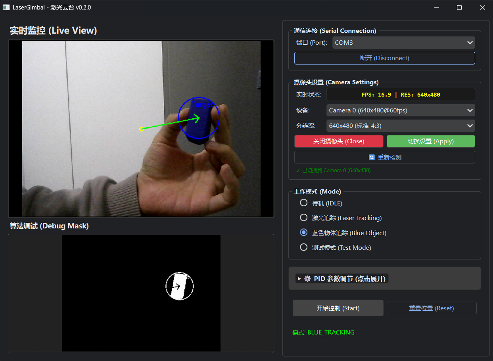
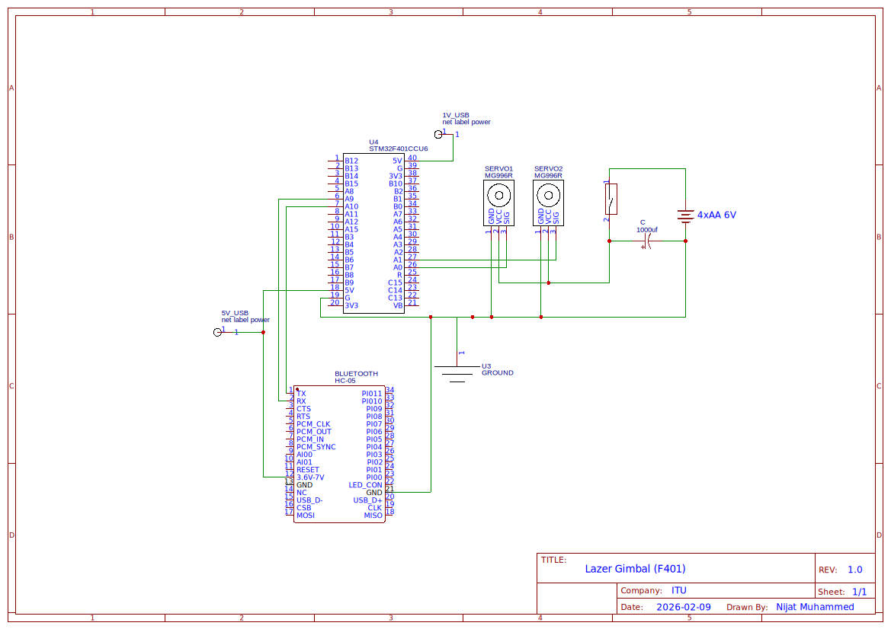

# Laser Gimbal Pro

A 2-axis laser gimbal tracking system using OpenCV and STM32.

## Overview
This project implements a computer vision-based tracking system that controls a 2-axis servo gimbal to follow a target (Red Laser or Blue Object). It uses a PID controller for smooth movement and includes a manual test mode for calibration.

## Demo Videos
- [V0.1.0 Laser Tracking Demo](https://www.youtube.com/shorts/czz0KMfvBXw) - Real-time laser tracking demonstration
- [V0.1.5 Laser Tracking Demo](https://www.youtube.com/watch?v=KGi6N0OxIrQ) - Real-time laser tracking demonstration PID test
- [V0.1.6 Manual Test Mode](https://www.youtube.com/shorts/dynt_BvkDTA) - Manual control and calibration

## Changelog

### [v0.3.6] - 2026-03-19
- **YOLO26 Tracking Engine**: Upgraded computer vision architecture from YOLOv8 to the cutting-edge NMS-Free YOLO26 `yolo26n.pt` model, substantially reducing bounding-box jitter and latency.
- **Center-Distance Data Association**: Implemented Euclidean distance-based target locking (`150px` threshold) instead of naive highest-confidence selection, securing persistent lock-on across frames.
- **Zero-Latency Error Processor**: Stripped out legacy `deque` moving average software filters in favor of raw 0-delay error passthrough with a structural `.max_pixel_jump` safety clamp.
- **Multithreaded PID Concurrency**: Decoupled the `GimbalController` from the PyQt `QTimer` event loop into an independent async Thread running at a rigid 40Hz (`time.perf_counter()`), neutralizing UI freeze impact on PID derivates.
- **Serial Comm Unblocking**: Rewrote `serial_thread.py` to prevent `readline()` deadlocks, securing microsecond-level telemetry transmission without queue blockage.
- **STM32 Edge-Case Mitigations**: 
  - Deployed `new_data_flag` logic to prevent "Blind Integral Windup" on asynchronous telemetry loss.
  - Rectified "Derivative Kick" spikes by ensuring continuous error-state flow when exiting deadzones.
  - Integrated Slew Rate Limiters (`MAX_SERVO_DELTA`) to protect physical servos from gear-stripping snapbacks.

### [v0.3.5] - 2026-03-19
- **STM32 Incremental PID**: Reverted the mathematically explosive positional PID algorithm on the STM32 to a true Incremental PID system, ensuring stable and reliable motor velocity output.
- **UI Deadzone Tuning**: Added a dedicated Deadzone control slider to the PID tuning panel. This allows structural "hunting" oscillation across stationary targets (caused by low camera framerate/delays) to be software filtered out.
- **Architectural Cleanup**: Removed hardcoded scaling tables and obsolete logic (`CONTROL_DEADZONE_LEVELS`, `ERROR_SCALING`) from `error_processor` enabling pure linear tracking control.
- **Industrial Tracking Roadmaps**: Documented future upgrade pathways (Kalman Filter, ADRC, Kinematic Lead Calculation) towards a professional-grade continuous tracking structure.

### [v0.3.0] - 2026-03-13
- **YOLOv8 Object Tracking**: Added Deep Learning capability with Ultralytics YOLOv8. 
- **Multi-Target Detection**: System can now scan and highlight multiple objects in the frame simultaneously (Yellow boxes) while selecting and tracking the most confident target (Red Box with `[LOCKED]` label).
- **Dynamic Object Switching**: YOLO mode is configured to track any COCO dataset object dynamically, easily adaptable for specialized datasets (e.g., Drone tracking, Face tracking) by swapping the `.pt` models.
- **Dependency Loading Fix**: Resolved `WinError 1114` PyTorch CUDA runtime and PyQt6 DLL overlap issues ensuring smooth loading on Windows environments.

### [v0.2.0] - 2026-03-12
- **Power System Upgrade**: Integrated a 12V DC Adapter with an XL4016 Buck Converter to provide a dedicated, stable 6V power supply for the gimbal servos.
- **Framework Refactor & Bug Fixes**: Comprehensive codebase restructuring and resolution of several critical issues, including:
    - Fixed instability in serial communication for more reliable hardware commands.
    - Improved consistency of visual tracking for better target lock.
    - Stabilized PID control logic for significantly smoother movements.
    - Overhauled Graphical User Interface (GUI) for a more modern and intuitive aesthetic.
    - Enhanced step size and deadzone algorithms to increase tracking speed and responsiveness.


## System Images

<div align="center">
  
  <p><i>New External 720p USB Camera and Stable Power Module</i></p>
  
  
  <p><i>Pan-Tilt Servo Mechanism (MG996R)</i></p>
  
  
  <p><i>Control Interface - Real-time Status Monitoring & PID Tuning & Manual Test Panel</i></p>
</div>

## Features
- **Visual Tracking**: Real-time tracking using HSV color space, optimized for 720p.
- **PID Control**: Customizable PID algorithm for smooth servo positioning.
- **Dynamic Resolution**: Supports "Brute Force" MJPG mode to unlock 60 FPS on Windows drivers.
- **Clean UI**: Integrated status monitoring (FPS/RES) and real-time PID tuning.
- **Safety Mechanisms**:
  - Software Limits (0-180 degrees)
  - Vision Signal Watchdog (Timeout protection)
  - Movement Deadzone (Prevents servo jitter)

## Hardware Requirements

### Electronics
- **Microcontroller**: STM32F401CCU6 (Blackpill)
- **Servos**: 2x MG996R High-Torque Servos
- **Capacitor**: 1000µF Electrolytic Capacitor (Power filtering for servos)
- **Camera**: External 720p USB Desktop Camera (Mounted on gimbal)
- **Power Supply**: 12V 2A DC Adapter
- **Step-Down Module**: XL4016 Buck Converter (Regulated to stable 6V for servos)
- **Serial Communication**: HC-05 Bluetooth or direct USB-TTL
- **Laser**: Red laser pointer (optional, for tracking demonstration)

### Power Supply
- **OLD**: 4x 1.5V Duracell AA Batteries (6V output)
- **NOW**: 12V DC Adapter + XL4016 Buck Converter (for stable voltage and current)

### Mechanical Structure
- **3D Printed Pan-Tilt Mechanism**: [MakerWorld - Pan Tilt Servo Antenna Tracker MG996R](https://makerworld.com/en/models/973248-pan-tilt-servo-antenna-tracker-mg996r#profileId-945437)
- Designed for MG996R servos with robust mounting

### Circuit Schematic
<div align="center">
  
  <p><i>System Wiring Diagram - STM32F401, HC-05, MG996R Servos</i></p>
</div>

### Project Structure
```text
LazerGimbal/
├── config/                # Global configuration profiles
│   ├── control_config.py  # PID parameters, limits, and speed levels
│   ├── hardware_config.py # COM port and baud rate settings
│   └── vision_config.py   # HSV thresholds and camera resolution
├── core/                  # Core logic and hardware communication
│   ├── serial_thread.py   # Serial communication worker
│   ├── gimbal_controller.py # PID control loop and servo management
│   └── pid.py             # PID algorithm implementation
├── gui/                   # Graphical User Interface (PyQt6)
│   ├── main_window.py     # Main application window assembly
│   ├── test_panel.py      # Manual servo control panel
│   └── widgets/           # Modular UI components
│       ├── camera_view.py # Video feed display
│       ├── camera_panel.py# Camera/Resolution selection & Stats
│       └── pid_tuner.py   # Real-time PID parameter slider
├── vision/                # Computer vision processing
│   ├── vision_worker.py   # Frame processing and target detection
│   └── detector.py        # Color-based object detection logic
├── images/                # Hardware and schematic documentation
├── main.py                # Main application entry point
└── requirements.txt       # Project dependencies
```

## Software Requirements
- Python 3.10+
- Dependencies: `PyQt6`, `opencv-python`, `numpy`, `pyserial`, `qdarktheme`

## Installation
1. **Clone the repository**:
   ```bash
   git clone https://github.com/Nijat-M/LazerGimbal.git
   cd LazerGimbal
   ```

2. **Setup virtual environment**:
   ```bash
   python -m venv .venv
   .venv\Scripts\activate  # Windows
   ```

3. **Install dependencies**:
   ```bash
   pip install -r requirements.txt
   ```

4. **Run the application**:
   ```bash
   python main.py
   ```

## License
[MIT License](LICENSE)
