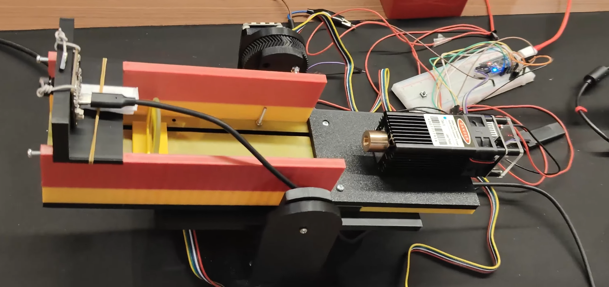
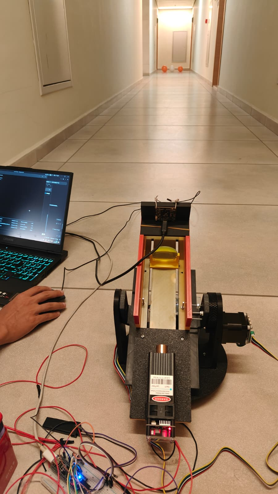
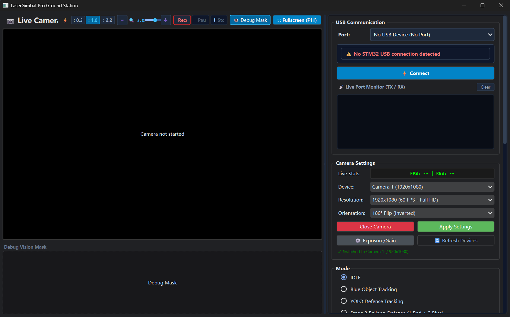

# 🎯 LazerGimbal Pro

<div align="center">

### Autonomous Air Defense & Precision Optical Laser Tracking System
**2-Axis High-Speed Closed-Loop Gimbal with Real-Time Computer Vision, IFF Defense & STM32 Firmware**

[](https://www.youtube.com/watch?v=ou6Uf3Ik7QI)
[](https://www.youtube.com/watch?v=ou6Uf3Ik7QI)
[](LICENSE)

<p align="center">
  
  
  
  
  
  
</p>

[🇬🇧 English](README.md) • [🇹🇷 Türkçe](README_TR.md)

</div>

---

## 📸 System Hardware & Field Deployment

<div align="center">
  <table>
    <tr>
      <td width="58%" align="center" valign="middle">
        
        <p><b>🔬 Hardware Prototype (Close-up)</b><br>
        <i>2-Axis Custom Gimbal, Optical Rail, High-Power Laser Module, Arducam Global Shutter & STM32 Controller</i></p>
      </td>
      <td width="42%" align="center" valign="middle">
        
        <p><b>🎯 15m Long-Range Field Test</b><br>
        <i>Live Corridor Target Acquisition, Autonomous Lock-On & Real-Time PC Telemetry</i></p>
      </td>
    </tr>
  </table>
</div>

---

## 📺 Demonstration Video

<div align="center">

### 🏆 [2026 Çelikkubbe Hava Savunma Sistemleri Yarışması | Başvuru ID: 5208679](https://www.youtube.com/watch?v=ou6Uf3Ik7QI)

[](https://www.youtube.com/watch?v=ou6Uf3Ik7QI)

*Click the thumbnail above to watch the official competition video featuring Stage 3 autonomous engagement, live IFF friendly-protection, and precision laser tracking.*

</div>

---

## 📌 Executive Summary

**LazerGimbal Pro** is an industrial-grade, 2-axis closed-loop optical laser tracking and air defense gimbal platform engineered for precision target acquisition, identification, and neutralisation. Built for **TEKNOFEST 2026 Çelikkubbe Air Defense Systems Competition**, the system tightly integrates high-speed computer vision with real-time embedded hardware control.

The system is architected across three core pillars:
1. **Host AI & Vision Engine (PC / PyQt6 / Python)**: Processes live camera streams at 60 FPS (using global shutter sensors), runs multi-space IFF (Identification Friend or Foe) chromatic algorithms, and executes Ultralytics YOLO deep-learning target classification with zero NMS latency.
2. **Real-Time Embedded Controller (STM32F401 / C HAL)**: Executes a continuous 10kHz hardware DDA (Digital Differential Analyzer) microstep pulse engine and a 50Hz Incremental PID loop driving **Makerbase MKS SERVO42C closed-loop vector stepper motors (`CR_vFOC`)** with absolute zero step loss and high holding torque.
3. **Yetenek 6 Zero-Annotation Synthetic Pipeline**: A synthetic dataset generator that automatically renders 3MF CAD meshes into multi-angle photorealistic targets, generating labeled YOLO training datasets without manual bounding box annotation.

---

## 🚀 Key Innovations & Features

### 🛡️ Stage 3 Autonomous Air Defense & IFF Engine
- **Autonomous Mission Director**: A 6-state competition state machine handling target acquisition, hostile engagement, post-fire evaluation (10s), automated emergency stop (ESTOP), stabilization delay (10s), and safe shutdown.
- **Robust Multi-Space IFF (Friend or Foe)**: Combines HSV, normalized BGR differential, and CIELAB chroma spaces to reliably classify Red Hostile vs. Blue Friendly targets while eliminating ambient background false-positives (yellow walls, wood frames).
- **100% Friendly Fire Prevention**: Real-time safety interlock strictly suppresses laser firing whenever a friendly blue asset enters the reticle zone.
- **Orange Balloon Hunt Mode**: Auto-locks and engages orange balloon targets continuously until physical balloon destruction is optically verified.

### 👁️ Computer Vision & Tactical HUD (PyQt6 / Python)

<div align="center">
  
  <p><i>Modern Cyber-Dark PyQt6 Tactical Interface — Live Camera Feed, Dual Target Lock-On, Debug Vision Mask & Device Control</i></p>
</div>

- **Arducam AR0234 Global Shutter Camera Support**: Fully adapted for high-speed industrial global shutter sensors (1080p @ 60 FPS), eliminating rolling-shutter jello distortion under aggressive gimbal slewing.
- **Tactical PiP Zoom Reticle**: Picture-in-Picture digital magnification scope synchronized in real time with the calibrated aim crosshair.
- **Constant Frame Rate (CFR 30fps) Video Recording**: Audio-video synced `.mp4` hardware container recording with microphone ambient audio mix and full telemetry HUD OSD overlay.
- **Zero-Flicker Spatial Multi-Target Tracker**: Multi-object Euclidean association and Kalman smoothing to eliminate bounding box flickering and ID swaps.
- **Dynamic Orientation Hot-Switching**: Instant 0° / 180° inverted ceiling mount and horizontal mirror modes without software restarts.

### ⚡ Embedded Motion Control (STM32F401 / C HAL)
- **10kHz Continuous-Phase DDA Pulse Engine**: Microstep generator preserving fractional step accumulators across control cycles for ultra-smooth low-speed tracking.
- **50Hz Incremental Closed-Loop PID**: Fine-tuned closed-loop tracking with dynamic deadband compensation and friction anti-stall minimum torque feed.
- **3-Speed Motor Gearbox**: Fast toggle (Keys `1`, `2`, `3`) for Recon, Cruise, and Sprint manual motor slewing speeds.
- **5-Layer Safety Protection**:
  1. **Surge Auto-Healing Reset**: Exception handlers instantly clamp motor pins to 0V and trigger a 1ms auto-reboot (`NVIC_SystemReset()`).
  2. **Dual Watchdog Timers**: 500ms hardware telemetry timeout halts STEP pulses if communication drops; PC watchdog stops stale commands after 250ms.
  3. **Velocity & Acceleration Limiting**: Bounded motor dynamics preventing step slippage.
  4. **Coordinate Boundary Clamping**: Filters UART transmission noise.
  5. **Non-Blocking Heartbeat Indicator (`PC13`)**: Visual hardware health feedback.

### 🧠 Yetenek 6 — 3MF Synthetic Training & Classification
- **Zero-Manual-Annotation Pipeline**: Converts official competition 3MF multi-body files (`Modeller.3mf`) to STL meshes and renders realistic multi-angle targets onto real ambient backgrounds.
- **Multi-Class Air Defense Detection**: Classifies `F16` fighter jets, `HELIKOPTER` attack helicopters, `BALISTIK_FUZE` ballistic missiles, and `MINI_IHA` mini-drones across 5m, 10m, and 15m test ranges.

---

## 🛠️ Hardware Bill of Materials (BOM)

| Component | Model / Specification | Purpose |
| :--- | :--- | :--- |
| **Microcontroller** | STM32F401CCU6 (Blackpill / ARM Cortex-M4 @ 84MHz) | Real-time motion control & DDA pulse engine |
| **Motors & Drivers** | 2x NEMA 17 Stepper Motors + MKS SERVO42C Closed-Loop FOC | 2-axis Pan/Tilt drive with magnetic encoder feedback |
| **Camera Sensor** | Arducam AR0234CS Global Shutter USB Camera (1080p @ 60fps) | High-speed, distortion-free optical acquisition |
| **Laser Emitter** | 650nm High-Power Red Laser Diode & Optics Rail | Precision target illumination & simulated engagement |
| **Power Supply** | 20V DC 2A+ Regulated Switching Power Supply | Motor power rail (`V+` / `GND`) |
| **Pan-Tilt Frame** | Custom reinforced 3D printed mechanical assembly | 2-axis rigid optical gimbal platform |

### 🔌 Hardware Pinout & Electrical Interface

| Subsystem | Signal Name | STM32F401 Pin | Connected Peripheral / Pin | Logic / Note |
| :--- | :--- | :--- | :--- | :--- |
| **Pan Axis (X)** | `X_STEP` | `PA0` (TIM2_CH1) | MKS SERVO42C `STP` Pulse | 3.3V Logic (Active High) |
| **Pan Axis (X)** | `X_DIR` | `PA4` (GPIO) | MKS SERVO42C `DIR` Direction | CW / CCW Polarity |
| **Tilt Axis (Y)** | `Y_STEP` | `PA1` (TIM2_CH2) | MKS SERVO42C `STP` Pulse | 3.3V Logic (Active High) |
| **Tilt Axis (Y)** | `Y_DIR` | `PA5` (GPIO) | MKS SERVO42C `DIR` Direction | CW / CCW Polarity |
| **Laser Emitter** | `LASER_PWM` | `PB0` (TIM3_CH3) | Laser Driver Optocoupler / TTL | 1kHz PWM Power / Gate Trigger |
| **Status Telemetry**| `HEARTBEAT` | `PC13` (GPIO) | On-board Blue LED | 500ms Non-blocking Pulse |
| **Host Link** | `USB_CDC` | `PA11` (DM) / `PA12` (DP) | PC USB 3.0 / USB-C Port | Native 12 Mbps Full-Speed CDC |
| **Motor Power** | `20V_RAIL` | External PSU | MKS Driver `V+` / `GND` | Common Ground (`COM` to STM32 GND) |

> [!NOTE]
> **Hardware Roadmap**: Breadboard wiring is utilized for rapid prototyping during preliminary trials. A custom integrated surface-mount PCB carrier board is currently in development for the final competition stage.

---

## 📂 Project Structure

```text
LazerGimbal/
├── main.py                     # Main application entry point (PyQt6 + PyTorch DLL guard)
├── run_app.bat                 # One-click Windows launch script
├── requirements.txt            # Python dependencies
├── Modeller.3mf                # Official 3MF 3D target models
├── CHANGELOG.md                # Detailed release notes & commit history
│
├── core/                       # Control & State Machine Layer
│   ├── gimbal_controller.py    # 40Hz visual tracking controller with PID & safety watchdog
│   ├── serial_thread.py        # Asynchronous high-speed serial UART communication
│   ├── stage3_mission_director.py # Stage 3 autonomous air defense state machine
│   └── control/                # Error calculation & manual mouse aim controllers
│
├── vision/                     # Computer Vision & Deep Learning Layer
│   ├── vision_worker.py        # Video capture, detection dispatcher, PiP scope & video recorder
│   ├── iff.py                  # Identification Friend or Foe (HSV + BGR + CIELAB)
│   ├── yolo_detector.py        # Ultralytics YOLO inference pipeline
│   ├── yetenek6_detector.py    # Yetenek 6 target detection adapter
│   └── yetenek6_stabilizer.py  # Spatial-temporal anti-jitter stabilizer
│
├── gui/                        # User Interface Layer (PyQt6)
│   ├── main_window.py          # Main dashboard window & docking layout
│   └── widgets/                # Modular UI widgets (Camera, Control, Mode, IFF, Calibration, PID)
│
├── config/                     # Configuration & Calibration Storage
│   ├── vision_config.py        # Camera FOV, resolution, color profiles, aim offset
│   ├── control_config.py       # PID parameters, speed gears, motion limits
│   ├── hardware_config.py      # Serial port baud rate & step pulse definitions
│   ├── device_config.py        # Persistent hardware & camera settings
│   └── yetenek6_config.py      # Yetenek 6 distance & target metrics
│
├── STM32F401/                  # Embedded MCU Firmware (C / STM32CubeIDE)
│   ├── Core/Src/main.c         # DDA pulse engine, incremental PID & safety handlers
│   └── Lazer_F401.ioc          # STM32CubeMX hardware pinout configuration
│
├── yetenek6/                   # Synthetic Dataset & YOLO Training Pipeline
│   ├── README_ZH.md            # Detailed pipeline guide (Chinese)
│   ├── HIZLI_BASLANGIC_TR.md   # Quick start guide (Turkish)
│   ├── models_3mf/             # Extracted STL model assets (F16, Helicopter, Missile, Drone)
│   ├── backgrounds/            # Real background environments for synthetic overlay
│   └── scripts/                # S0 Camera test -> S1 Render -> S2 Dataset -> S3 Train -> S4 Detect
├── docs/                       # Technical Research, Parameter Tuning & Roadmaps
│   ├── Phase3_Kalman_Tracking_Plan.md # Kinematic state estimation & EKF plan
│   ├── Phase4_Future_Industrial_Upgrades.md # IMU cascade, ADRC & PnP fire control plan
│   └── TRACKING_PARAMETERS_GUIDE.md # Parameter tuning baselines & physical formulas
│
└── tests/                      # Automated Unit & Integration Tests
    ├── test_stage3_balloon.py  # Stage 3 balloon defense & mission state machine test
    ├── test_balloon_hunt.py    # Orange balloon segmentation & shape validation
    ├── test_iff_color.py       # IFF chromatic discrimination test
    └── test_manual_mouse_control.py # Gimbal motion & serial command verification
```

---

## ⚡ Quick Start

### 1. Prerequisites
- **Operating System**: Windows 10 / 11 (64-bit)
- **Python**: 3.10 or higher
- **NVIDIA GPU** (Optional for CUDA-accelerated YOLO inference)

### 2. Installation
```bash
# Clone repository
git clone https://github.com/Nijat-M/LazerGimbal.git
cd LazerGimbal

# Create virtual environment
python -m venv .venv
.venv\Scripts\activate

# Install dependencies
pip install -r requirements.txt
```

### 3. Launch Application
```bash
python main.py
# Or run with the bundled batch file:
run_app.bat
```

---

## 📜 License & Acknowledgments

This project is licensed under the **[MIT License](LICENSE)**.

Developed for **TEKNOFEST 2026 Çelikkubbe Air Defense Systems Competition (Başvuru ID: 5208679)**. Special thanks to the open-source robotics and computer vision communities.
