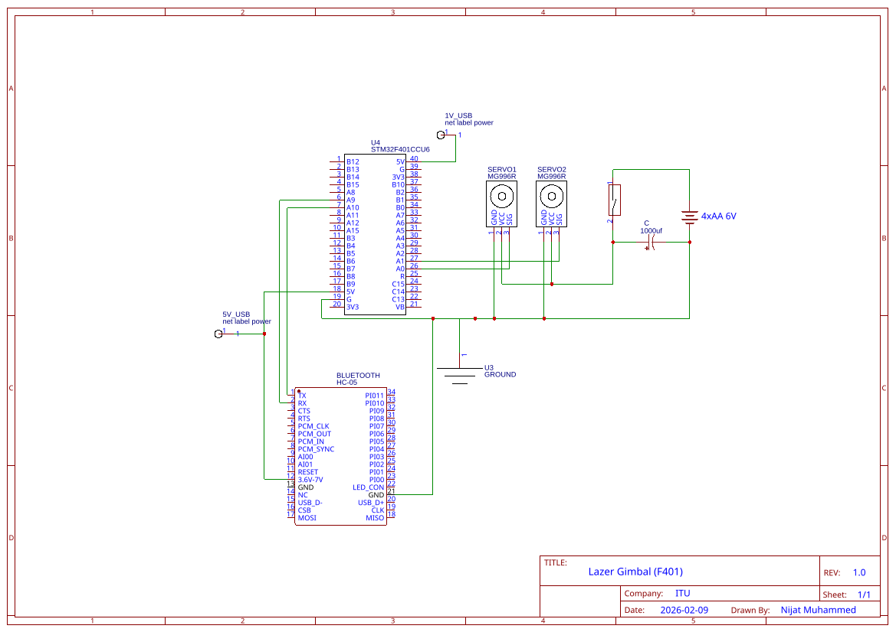

# Laser Gimbal Pro

<div align="left">
  
  
  
  
</div>

<br>

<div align="right">
  🇬🇧 <a href="README.md">English</a> | 🇹🇷 <a href="README_TR.md">Türkçe</a>
</div>

Masaüstü bilgisayarlı görü (computer vision) ile gerçek zamanlı mikrodenetleyici donanım yürütmesini harmanlayan 2 eksenli (2-axis) lazer gimbal takip sistemi.

## Genel Bakış (Overview)
Bu proje, bilgisayarlı görü ve gerçek zamanlı bir mikrodenetleyicinin birleşimi ile çalışan deneysel bir 2 eksenli lazer gimbal takip sistemidir. Sistem, kamera anlık görüntülerini işlemek, hedefleri algılamak (HSV renk takibi veya YOLO tabanlı derin öğrenme kullanarak) ve konum hatalarını hesaplamak için PyQt6/Python tabanlı bir masaüstü uygulaması kullanır. Hesaplanarak elde edilen bu hata koordinatları, daha sonra yüksek hızlı bir seri iletişim (115200 baud) üzerinden STM32F401 mikrodenetleyicisine iletilir.

Donanım tarafında ise STM32, kamerayı etkili bir şekilde hedefin merkezinde tutabilmek için **10kHz donanımsal DDA (Digital Differential Analyzer) mikro-adım darbe üreteci** ve **50Hz Artımlı PID (Incremental PID) algoritması** çalıştırarak iki adet **Makerbase MKS SERVO42C kapalı çevrim step motoru (`CR_vFOC`)** sıfır adım kaybı ve yüksek tutma torkuyla kusursuzca sürer. Proje, gerçek zamanlı izleme, PID parametre ayarı, çift modlu manuel kontrol (tıkla-adım-at ve basılı-tut-döndür) ve bağımsız klavye kontrolü sunan modern bir PyQt6 arayüzüne sahiptir.

*Not: Bu sistem Teknofest yarışmaları ve hassas optik gimbal sistemleri için geliştirilmiş ileri düzey bir prototip niteliğindedir.*

## Demo Videoları
- [V0.1.0 Lazer Takip Demosu](https://www.youtube.com/shorts/czz0KMfvBXw) - Gerçek zamanlı lazer takip tanıtımı
- [V0.1.5 Lazer Takip ve PID Demosu](https://www.youtube.com/watch?v=KGi6N0OxIrQ) - Geliştirilmiş PID tepkisi ile gerçek zamanlı takip
- [V0.1.6 Manuel Test Modu](https://www.youtube.com/shorts/dynt_BvkDTA) -  Manuel kontrol paneli ve kalibrasyon

## Değişiklik Günlüğü (Changelog)
Güncellemelerin ve düzeltmelerin detaylı geçmişi için lütfen [CHANGELOG_TR.md](CHANGELOG_TR.md) dosyasına göz atın.

## Temel Özellikler (Core Features)

### 👁️ Bilgisayarlı Görü ve Kontrol Arayüzü (PC / Python)
- **Arducam AR0234 Global Shutter Kamera Desteği**: Yüksek hızlı endüstriyel global shutter sensörleri (Onsemi AR0234CS) için tam uyarlama; agresif gimbal hareketlerinde dahi sıfır hareket bulanıklığı ve jello/rolling-shutter bozulmasız kusursuz takip.
- **Piramit Çok Ölçekli Algılama Hızlandırması**: Tek geçişli HSV segmentasyonu ve piramit alt örnekleme ile 1080p işlem gecikmesi **~3.2ms** seviyesine indirilerek sıfır kare kaybıyla stabil **60 FPS** gerçek zamanlı takip sağlandı.
- **Anlık Görüntü Yönü Sıcak Değişimi**: Tavana/ters montaj (180° ters çevirme) ve yatay ayna modları doğrudan arayüzden gecikmesiz olarak uygulanabilir.
- **Ultralytics YOLO26 NMS-Free Derin Öğrenme**: `yolo26n.pt` ve NVIDIA CUDA 12.6 GPU hızlandırması ile çalışan yerel uçtan uca nesne algılama motoru; NMS işlem gecikmeleri ve hedef kutusu titremeleri tamamen ortadan kaldırıldı.
- **Asenkron Ayrıştırılmış Algılama İşlem Hattı**: 60 FPS video yakalama ve UI çizim akışını GPU sinir ağı çıkarımından ayıran çift tamponlu mimari sayesinde mikro-takılmalar (micro-stuttering) tamamen engellendi.
- **Çift Takip Modu (Dual Tracking)**: Hafif ve yüksek performanslı HSV renk takibi ile Derin Öğrenme tabanlı nesne algılama (Ultralytics YOLO26 `yolo26n.pt`) algoritmaları arasında sorunsuzca geçiş imkanı.
- **Kesintisiz Hedef Kilidi**: Çerçevedeki birden fazla algılanan hedef karşısında stabiliteyi koruyabilmek için, merkeze olan Öklid (Euclidean) uzaklığı eşik algoritması temel alınarak veri ilişkilendirmesi.
- **Çok İş Parçacıklı İşleme (Multithreading)**: Arayüz güncellemeleri (`QTimer`), kamera kare işleme (`vision_worker`) ve seri haberleşme (`serial_thread`) için atanmış asenkron iş parçacıkları kullanılarak UI donmaları tamamen engellenmiştir.
- **Gelişmiş Manuel ve Klavye Kontrolleri**:
  - **Tıkla-Adım-At (Tap-to-Step)**: Kısa tıklamalar hassas ve net tek adımlık mikro-adım ayarı yapar.
  - **Basılı-Tut-Döndür (Press-and-Hold)**: 40Hz pürüzsüz sürekli dönüş ve bırakıldığında anında yumuşak frenleme.
  - **Klavye Modu Anahtarı**: `WASD` ve Yön tuşları (`↑ / ↓ / ← / →`) ile kontrolü açıp/kapatan bağımsız güvenlik seçimi.
- **Tek Tıkla Akıllı Takip Başlatma**: Seri port ve kamera durumunu doğrulayarak hedef takibini sorunsuz başlatan "Kontrolü Başlat" butonu.

### ⚙️ Gerçek Zamanlı Hareket Kontrolü (STM32 MCU / C)
- **10kHz Donanımsal DDA Mikro-Adım Darbe Üreticisi**: `TIM2` donanım kesmesinde 100μs çözünürlüklü Bresenham / DDA darbe dağıtıcısı ile sessiz, pürüzsüz mikro-adım sürüşü (16 mikro-adım = 3200 darbe/tur).
- **50Hz Artımlı PID Motor Kontrolü**: Her 20ms'de hız artımlarını ($\Delta\text{Steps}$) hesaplar, integral birikmesine (windup) karşı doğal korumalıdır.
- **5 Katmanlı Endüstriyel Güvenlik ve Hata Koruma Mimarisi**:
  1. **Dalgalanma Otomatik İyileşme (Auto-Healing Reset)**: Hata yakalayıcılar (`HardFault_Handler` / `Error_Handler`) motor pinlerini anında 0V'a çeker ve ani voltaj sıçramalarında 1ms'de otomatik yeniden başlatma (`NVIC_SystemReset()`) uygular.
  2. **Donanımsal Görsel Bekçi (Watchdog)**: Veri akışı koptuğunda 2.0 saniye içinde motor darbelerini durdurur ve şaftı kilitler.
  3. **Hız Değişim Sınırlayıcı (Slew Rate Limiter)**: Döngü başına maksimum adım sınırı (`MAX_STEPS_PER_CYCLE = 80`) ile motorun kontrolden çıkmasını matematiksel olarak engeller.
  4. **UART Koordinat Sınırlaması**: Seri gürültülere karşı giriş hatası $\pm 400\text{px}$ ile sınırlandırılmıştır.
  5. **500ms Bloklanmayan Durum Bildirim LED'i (`PC13`)**: Donanımın çalıştığını gösteren canlı kalp atışı (heartbeat) göstergesi.

## Donanım Gereksinimleri

### Elektronik
- **Mikrodenetleyici**: STM32F401CCU6 (Blackpill)
- **Motorlar ve Sürücüler**: 2x NEMA 17 Step Motor ve Makerbase MKS SERVO42C Kapalı Çevrim Vektör Sürücü Kartları (`CR_vFOC` modu)
- **Kamera**: Arducam AR0234 Global Shutter Yüksek Hızlı USB Kamera (1080p @ 60 FPS) / UVC Masaüstü Kamera
- **Güç Kaynağı**: 20V DC 2A+ Güç Kaynağı (Motor güç hattı)
- **Sinyal Bağlantısı**: Ortak Katot (Common Cathode) bağlantısı (`COM` ve `GND` STM32 GND pinine; `PA0` X_STP, `PA4` X_DIR, `PA1` Y_STP, `PA5` Y_DIR)
- **Lazer**: Kırmızı lazer diyot / işaretçi (Takip testleri için, opsiyonel)

### Güç Mimarisi
- **Motor Gücü**: 20V DC doğrudan sürücü kartlarının `V+` ve `GND` klemenslerine bağlıdır.
- **Mantık Seviyesi (Logic)**: Ortak toprak referanslı 3.3V STM32 GPIO sinyal sürüşü.


### Mekanik Altyapı
- **3 Boyutlu Yazdırılan Pan-Tilt Sistemi**: [MakerWorld - Pan Tilt Servo Antenna Tracker MG996R](https://makerworld.com/en/models/973248-pan-tilt-servo-antenna-tracker-mg996r#profileId-945437)

### Devre Şeması (Schematic)
<div align="center">
  
  <p><i>Sistem Elektrik Bağlantı Şeması - STM32F401, HC-05, MG996R Servolar</i></p>
</div>

### Proje Dosya Yapısı (Project Structure)
```text
LazerGimbal/
├── config/                # Global konfigürasyon profilleri
│   ├── control_config.py  # PID parametreleri, limitler
│   ├── hardware_config.py # COM port ve Baud Rate ayarları
│   └── vision_config.py   # HSV eşikleri ve kamera çözünürlüğü
├── core/                  # Çekirdek mantık ve haberleşme
│   ├── serial_thread.py   # Asenkron yüksek hızlı seri haberleşme işçisi
│   ├── gimbal_controller.py # 40Hz Çalışan ana döngü & Güvenlik kontrolcüsü (Watchdog)
│   └── control/           
│       └── error_processor.py # Görsel hataların matematiksel sınırlandırıcıları
├── gui/                   # Grafiksel Kullanıcı Arayüzü (PyQt6)
│   ├── main_window.py     # Ana pencerenin montaj noktası
│   ├── test_panel.py      # Manuel servo sürüş kontrol paneli
│   └── widgets/           # Modüler arayüz bileşenleri
├── STM32F401/             # MCU Donanım Yazılımı (Firmware) (C/C++ HAL)
│   ├── Core/Src/main.c    # Donanım tabanlı Artımlı PID çekirdeği ve limit korumaları
│   └── Lazer_F401.ioc     # STM32CubeMX konfigürasyon dosyası
├── utils/                 # Genel yardımcı araçlar (Log, Kayıt)
├── vision/                # Bilgisayarlı Görü (Computer Vision) operasyonları
│   ├── vision_worker.py   # Kareleri yakalayan/işleyen arka plan aracı
│   ├── detector.py        # Temel arayüz sınıfı
│   ├── yolo_detector.py   # YOLO26 destekli Derin Öğrenme sınıfı
│   └── models/            # Sinir ağı ağırlıkları (.pt)
├── CHANGELOG.md           # Harici tutulan versiyon geçmişi
├── main.py                # Sistemin giriş/tetiklenme noktası
└── requirements.txt       # Gerekli bağımlılıklar
```

## Yazılım Gereksinimleri
- Python 3.10 veya üzeri
- Kullanılan Kütüphaneler: `PyQt6`, `opencv-python`, `numpy`, `pyserial`, `qdarktheme`

## Kurulum (Installation)
1. **Projeyi klonlayın (Clone)**:
   ```bash
   git clone https://github.com/Nijat-M/LazerGimbal.git
   cd LazerGimbal
   ```

2. **Sanal ortamı oluşturun (Virtual environment)**:
   ```bash
   python -m venv .venv
   .venv\Scripts\activate  # Windows
   ```

3. **Gerekli Python paketlerini yükleyin**:
   ```bash
   pip install -r requirements.txt
   ```

4. **Sistemi başlatın**:
   ```bash
   python main.py
   ```

## Lisans
[MIT Lisansı](LICENSE)